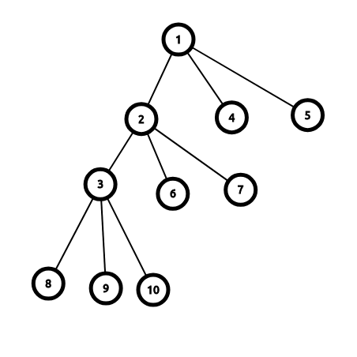

# LOJ2187 「SHOI2014」三叉神经树
<table width=100%>
<tr>
<td>
    <a href="/题解/LOJ2186 「SDOI2015」道路修建">←	LOJ2186 「SDOI2015」道路修建</a>
</td>
<td style="text-align:center">
    <b>LOJ2187 「SHOI2014」三叉神经树</b> 
    （<a href="https://loj.ac/problem/2187">原题链接</a>）
</td>
<td style="text-align:right">
    <a href="/题解/LOJ2188 「SHOI2014」神秘金字塔" style="color:#F00">LOJ2188 「SHOI2014」神秘金字塔→</a>
</td>
</tr>
</table>

## 题意
有一个 \((3n+1)\) 个节点的树，其中 \(n\) 个节点是非叶节点且必定有 \(3\) 个子节点，另外 \((2n+1)\) 个节点是叶节点。定义子节点为输入端，父节点为输出端，则每个非叶节点的输出为输入端中0和1较多的那一个。叶节点的输出是确定的。

要求完成 \(m\) 个操作，操作类型包括修改某个叶节点的输出和询问根节点的输出。

\(1 \leq n,m \leq 600000\) 。

## 题解
定义非叶节点的权值为输入端1的个数。

由于修改叶节点的输出可能会导致其祖先的权值发生改变，所以这相当于路径修改。

路径修改和单点询问，这使我们考虑树链剖分。

但要怎么进行路径修改呢？

观察例子我们可以发现，当叶节点由0变1时，**修改的一定是从叶节点向上连续的一段路径，且路径上的节点的权值必定为1。**

如上图，叶节点输出分别为1 0 0 0 0 0 1。当修改叶节点8的输出（从0变成1）时，会对节点2、3、8造成影响，其中5的权值为1。

节点3的权值为1，这意味着只要它有一个子节点的输出由0变1，则它的输出同样也会由0变1。

节点2的权值为0，这意味着即使它有一个子节点的输出由0变1，它的输出也不会改变；它的输出不改变，则它的祖先也不会有任何影响。

因此，我们得出一个基础算法：

1. 找出从叶节点到根节点路径上，深度最大的权值**不为**1的节点p；
2. 修改叶节点到节点p上路径的节点。

这个过程可以使用线段树维护。

令 \(seg[k]\) 分别为区间内权值**不为** \(k\) 的节点个数（ \(0 \leq k \leq 2\) ）。

对于叶节点，直接修改即可，不需要放入线段树维护；

对于节点p，需要修改它的权值和线段树内的权值；

对于其他节点，由于它们的权值全部为1，直接将 \(seg[1]\) 区间**加**1和 \(seg[2]\) 区间**减**1。

查询的时候使用二分等方式即可。

时间复杂度： \(O(n \log^2 n)\)

**注意：由于线段树常数较大，所以这道题需要一定的卡常技巧（如快速输入输出、register等），否则可能会因常数过大而超时。**

**此外，LGOJ上本题的时间限制为4s，LOJ上为1s。使用部分卡常技巧就可以实现1s内解决问题。**
